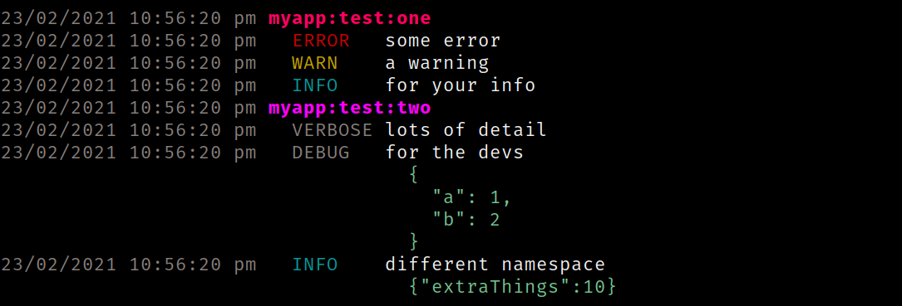

# logslot

[](https://github.com/markwylde/logslot/releases)
[](https://github.com/markwylde/logslot/blob/master/LICENSE)

A tiny logger that outputs json at runtime and pretty logs during development

## Example Usage
```javascript
const logslot = require('logslot');
logslot('myapp.test.one').error('some error', { extraThings: 1 })
logslot('myapp.test.one').warn('a warning', { extraThings: 2 })
logslot('myapp.test.one').info('for your info', { extraThings: 3 })
logslot('myapp.test.one').verbose('lots of detail', { extraThings: 4 })
logslot('myapp.test.one').debug('for the devs', { a: 1, b: 2 })
logslot('myapp.test.two').info('different namespace', { extraThings: 10 })
```

### Output (json)
```json
["23/02/2021 10:57:37 pm","myapp:test:one","ERROR","some error"]
["23/02/2021 10:57:37 pm","myapp:test:one","WARN","a warning"]
["23/02/2021 10:57:37 pm","myapp:test:one","INFO","for your info"]
["23/02/2021 10:57:37 pm","myapp:test:two","VERBOSE","lots of detail"]
["23/02/2021 10:57:37 pm","myapp:test:two","DEBUG","for the devs",{"a":1,"b":2}]
["23/02/2021 10:57:37 pm","myapp:test:two","INFO","different namespace",{"extraThings":10}]
```

### Output (pretty)
```bash
LOGSLOT_FORMAT=pretty
```



## License
This project is licensed under the terms of the MIT license.
